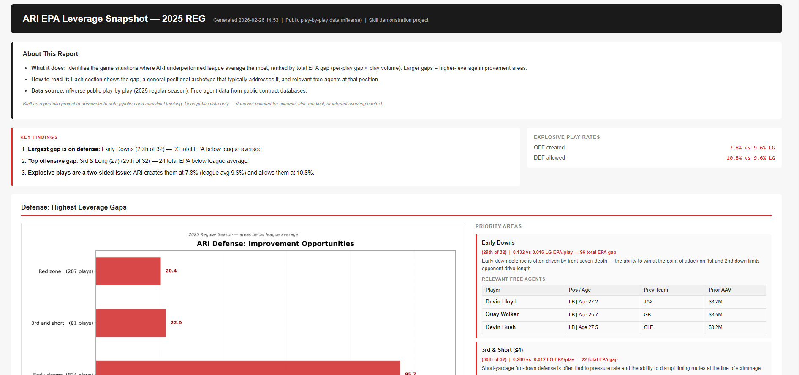

# NFL EPA Leverage Report

A Python tool that identifies an NFL team's highest-leverage improvement opportunities by comparing situational EPA efficiency against league averages, weighted by play volume.

## Live Report

View the Arizona Cardinals 2025 Report: https://tersch23.github.io/NFL-Leverage-Report/



## What It Does

- Pulls public play-by-play data from nflverse
- Computes EPA per play by game situation (early downs, 3rd and short, red zone, etc.) for the selected team vs. league average
- Ranks gaps by total EPA impact (per-play gap x play volume) to surface the highest-priority areas
- Generates bar charts, data tables, and an HTML report with relevant free agents at each position of need
- Works for any NFL team and any season available in the nflverse dataset

## How to Run

**Install dependencies:**
```bash
pip install pandas numpy matplotlib pyarrow nflreadpy tqdm
```

**Run the report:**
```bash
python Updated_Cardinals_Report.py --season 2025 --team ARI
```

Output goes to `./out/` including a CSV, two chart PNGs, and an HTML report.

## Tech Stack

- Python, Pandas, NumPy, Matplotlib
- nflverse / nflreadpy (play-by-play data)
- Expected Points Added (EPA) as primary efficiency metric

## Notes

- EPA gap is not a prediction — it measures how far a team's situational efficiency was from league average
- Situational buckets overlap (e.g. red zone plays also appear in early-down totals) — gaps are not additive
- Does not account for opponent quality, scheme, injuries, or internal scouting context
- Built as a portfolio project to demonstrate data pipeline construction and analytical thinking

## Author

Jacob VonTersch — [@Tersch23](https://github.com/Tersch23)  
Data Analytics, Syracuse University iSchool
